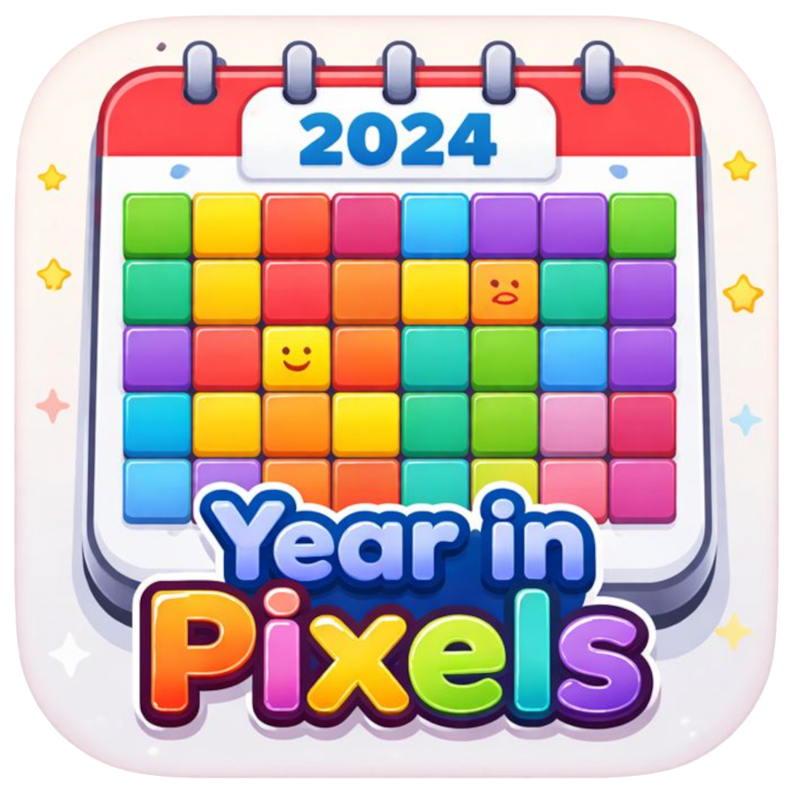

# Year in pixels

A "Year in Pixels" is a visual representation of your mood or experiences throughout the year, typically using a grid where each square represents a day. You can color-code each square based on your mood or significant events for that day.

This repository provides a simple implementation of a Year in Pixels tracker. You can customize the colors and moods to fit your personal preferences.